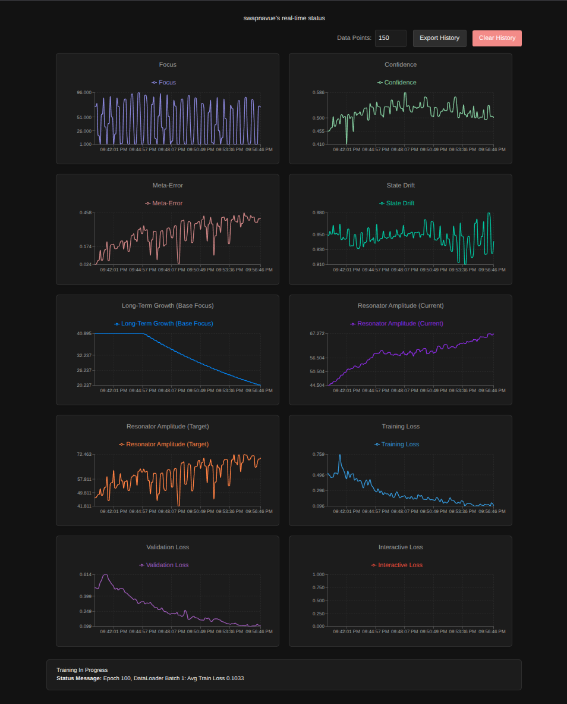
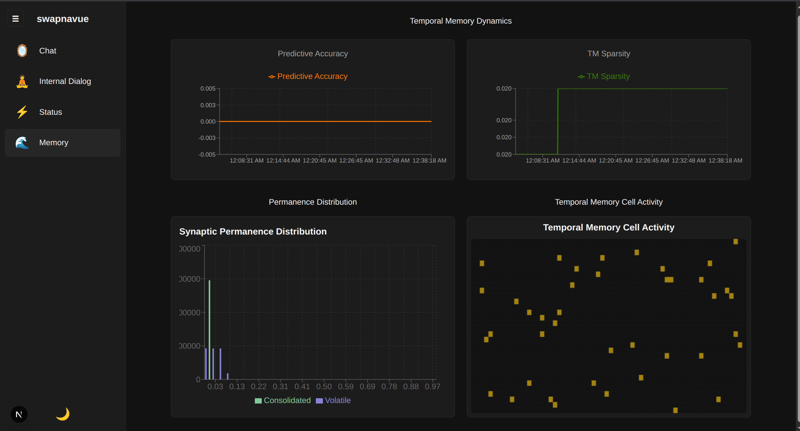

# SwapnaVue: A Continuously Reasoning HTM Architecture




SwapnaVue is an advanced, experimental software architecture designed to simulate a continuously learning artificial cognitive system. It integrates principles from neuroscience and economics to create a model that learns from data streams, forms long-term memories, and dynamically regulates its own internal state over time.

## Acknowledgments

This project stands on the shoulders of giants. We extend our sincere gratitude to:

* **Numenta:** For their pioneering research into Hierarchical Temporal Memory (HTM) and the principles of cortical computation that form the basis of our learning systems.
* **The Ampleforth Team:** For developing the innovative rebase protocol. Their work on creating a stable, decentralized unit of account inspired our cognitive rebase mechanism, which adapts their economic principles to regulate the internal state of an AI.

## Table of Contents

-   [The Three Pillars of SwapnaVue](#the-three-pillars-of-swapnavue)
    -   [Pillar 1: The HTM Learning Core](#pillar-1-the-htm-learning-core-the-brain)
    -   [Pillar 2: The Long-Term Memory System (Inspired by Sleep)](#pillar-2-the-long-term-memory-system-inspired-by-sleep)
    -   [Pillar 3: The Cognitive Rebase Mechanism (The Heartbeat)](#pillar-3-the-cognitive-rebase-mechanism-the-heartbeat)
-   [System Architecture](#system-architecture)
-   [How It All Works Together: The Full Learning Cycle](#how-it-all-works-together-the-full-learning-cycle)
-   [Key Features](#key-features)
-   [Technology Stack](#technology-stack)
-   [Getting Started](#getting-started)
-   [Theoretical Foundation](#theoretical-foundation)
-   [Project Status](#project-status)

## The Three Pillars of SwapnaVue

SwapnaVue's uniqueness comes from the synthesis of three advanced concepts that function as the pillars of its cognitive architecture.

### Pillar 1: The HTM Learning Core (The Brain)

At its most fundamental level, the system uses the principles of Hierarchical Temporal Memory (HTM) for learning and prediction.

* **Spatial Pooler (`src/spatial_pooler.py`):** Converts all incoming data into Sparse Distributed Representations (SDRs). This creates a rich semantic encoding that the rest of the system can learn from.
* **Temporal Memory (`src/temporal_memory.py`):** This is the primary learning component. It receives streams of SDRs and learns sequences by forming synaptic connections between cells that activate in succession. This allows it to make constant, real-time predictions about what is likely to happen next.

### Pillar 2: The Long-Term Memory System (Inspired by Sleep)

A central challenge in AI is the **plasticity-stability dilemma**: how can a system learn new things continuously (plasticity) without overwriting and destroying what it has already learned (stability)? SwapnaVue addresses this with a two-part long-term memory system directly inspired by the role of sleep in human memory consolidation. We call it the "No-Sleep" consolidation model.

#### The Two States of Memory

The `TemporalMemory` module doesn't just have one set of connections; it maintains two distinct states of synaptic permanence:

* **Volatile Permanences (Short-Term Working Memory):** Think of this as the system's "scratchpad." It's a highly plastic set of connections that learns very quickly during the `learn_one_step` process. This allows the model to be adaptive and responsive to what is happening *right now*. However, these memories are transient and designed to be overwritten.
* **Consolidated Permanences (Long-Term Knowledge Base):** This is the system's hardened, long-term knowledge. These connections are stable and change very slowly. They are protected from the volatility of immediate experience, providing a stable foundation that prevents catastrophic forgetting.

#### The Consolidation Process

The `ConsolidationManager` (`src/consolidation.py`) is the active process that transfers knowledge from the volatile state to the consolidated state, turning experience into wisdom.

1.  **Tagging Significant Memories:** The system first decides what is important. If an experience is understood with high confidence and low error, the `ContinuouslyReasoningPredictor` "tags" the memory trace as significant.
2.  **The Consolidation Queue:** Tagged memories are placed in a queue, ensuring an orderly, first-in-first-out processing of important events.
3.  **Asynchronous "Sleep" Cycle:** The `ConsolidationManager` runs on a separate background thread. It acts like a sleeping brain, replaying the important memories from the queue and carefully integrating them into the **consolidated permanences** of the `TemporalMemory`. The key innovation is that this "sleep" happens continuously in the background, allowing the system to learn and consolidate simultaneously.

### Pillar 3: The Cognitive Rebase Mechanism (The Heartbeat)

This is the system's metabolic regulation, inspired directly by the Ampleforth protocol. It's a feedback loop that adjusts the AI's core cognitive parameters to maintain learning stability over the long term.

| Ampleforth Concept     | SwapnaVue Adaptation                                      |
| :--------------------- | :---------------------------------------------------------- |
| **Price** | Model Performance (average `long_term_confidence` & `meta_error`) |
| **Price Target** | A target zone of high confidence and low error              |
| **Token Supply** | Core Cognitive Parameters (`base_focus`, `base_curiosity`)  |
| **Rebase Adjustment** | A proportional, multiplicative change to those parameters   |

This mechanism, implemented in the `Heart` module (`src/heart.py`), allows the system to autonomously "grow" more curious when it performs well, or become more cautious when it struggles, ensuring homeostatic balance.

## System Architecture

The three pillars are implemented across several key modules:

-   **`ContinuouslyReasoningPredictor` (`model_architecture.py`):** The central nervous system that orchestrates the entire data flow and learning lifecycle.
-   **`SpatialPooler` & `TemporalMemory`**: The core HTM learning components.
-   **`EmotionalCore` (`emotion.py`):** Holds the baseline cognitive parameters (`base_focus`, `base_curiosity`) that are the target of the rebase mechanism.
-   **`Heart` (`heart.py`):** Implements the rebase logic, measuring performance and adjusting the `EmotionalCore`.
-   **`ConsolidationManager` (`consolidation.py`):** The background worker that runs the "sleep" cycle for long-term memory formation.
-   **`TrainingManager` (`training_manager.py`):** Manages the overall training process and triggers the `Heart`'s rebase mechanism after periodic validation checks.

## How It All Works Together: The Full Learning Cycle

1.  **Input & Pooling**: Data enters the `ContinuouslyReasoningPredictor` and is encoded into an SDR by the `SpatialPooler`.
2.  **Prediction & Volatile Learning**: The `TemporalMemory` makes a prediction and then learns from the new SDR by updating its **volatile permanences**.
3.  **Tagging & Consolidation**: If the memory is significant, it's passed to the `ConsolidationManager`'s queue to be slowly integrated into **consolidated permanences** in the background.
4.  **Rebase & Regulation**: During long training runs, the `TrainingManager` triggers the `Heart`, which evaluates long-term performance and applies a rebase (expansion or contraction) to the system's core parameters in the `EmotionalCore`. This completes the regulatory feedback loop.

## Key Features

-   **Lifelong, Continuous Learning**: The model can learn 24/7 from a continuous stream of data.
-   **No Catastrophic Forgetting**: The sleep-inspired two-phase memory system protects long-term knowledge.
-   **Autonomous Cognitive Regulation**: The rebase mechanism allows the model to self-regulate its core learning parameters.
-   **Real-time Prediction**: Predicts upcoming states using both short-term and long-term memory.
-   **Asynchronous "No-Sleep" Architecture**: Key processes run in the background without interrupting real-time learning.
-   **Interactive UI**: A web-based interface built with Next.js to monitor the model's internal state.

## Technology Stack

-   **Backend**: Python, PyTorch, FastAPI, NumPy
-   **Frontend**: Next.js, TypeScript, React, Tailwind CSS
-   **Containerization**: Docker, Docker Compose

## Getting Started

The project is containerized for simple, one-command setup.

**Prerequisites**:
* Docker
* Docker Compose

**Installation & Running**:

1.  **Clone the repository**.
2.  **Environment Variables**: Create `.env` files based on the provided examples (`env.txt`, `frontend/env.local.txt`) and populate them.
3.  **Build and run the services**:
    ```bash
    docker-compose up --build
    ```
    This command will build and start both the backend and frontend services.

## Theoretical Foundation

The models in this project are based on the synthesis of multiple sources:
-   **Numenta's Publications**: The core HTM implementation is derived from the principles of cortical learning.
-   **The Ampleforth Protocol**: The rebase mechanism is a direct adaptation of the economic principles behind the AMPL token.
-   **`theories/memory.md`**: This repository document details the design of our two-phase plasticity and "No-Sleep" consolidation model.

## Project Status

This project is a robust, feature-complete implementation of the concepts laid out in its theoretical documents. All core components are implemented and integrated:
-   HTM components (Spatial Pooler, Temporal Memory)
-   Two-phase (volatile/consolidated) memory system
-   Asynchronous, "no-sleep" consolidation manager
-   Cognitive rebase mechanism for autonomous parameter regulation
-   Full backend/frontend integration via WebSockets
-   Dockerized deployment setup

It is ready for experimentation, training, and further development.
